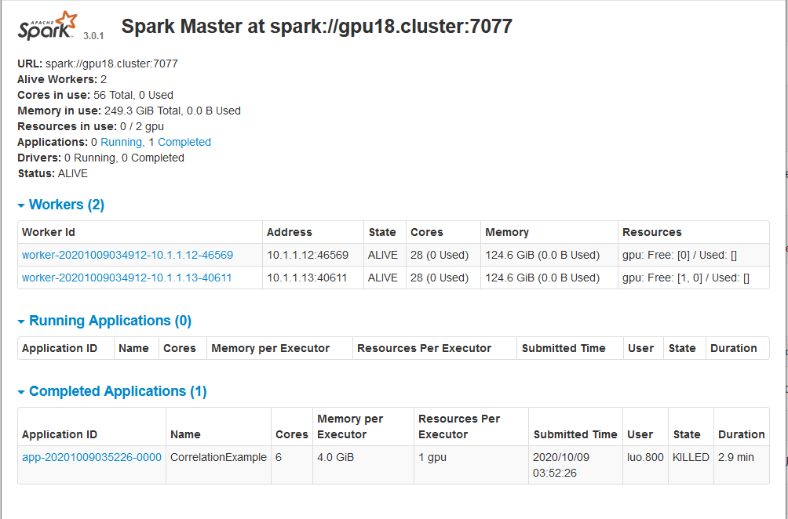

# NVIDIA RAPIDS setup guide in Spark

This is a general guide line about how to setup RAPIDS in RI2 cluster.

## Environment

```
OS:CentOS 7.8
Java:1.8
```

## Tool installation

 Due to the oracle policy, one of the easy way to install java is downloading java on the local and upload it to Ri2 cluster via sftp or other methods. Notice that scala have a good support on java 8 and java 11, so it is recommend to download java 8 instead of the newest version of Java. Once the java binary uploaded and uncompressed to the cluster, it is recommended to create a folder in order to manage different java versions:

```bash
mkdir java
mkdir maven
mkdir scala
mkdir sbt
mkdir javalib

#you need to upload downloaded jdk tar to the cluster and unzip it

#get maven
wget http://apache.spinellicreations.com/maven/maven-3/3.6.3/binaries/apache-maven-3.6.3-bin.tar.gz ./maven
#get scala
wget -q http://downloads.lightbend.com/scala/2.12.1/scala-2.12.1.tgz ./scala
#get sbt
wget -q https://github.com/sbt/sbt/releases/download/v1.4.0/sbt-1.4.0.tgz ./sbt
#get spark 
wget https://mirror.olnevhost.net/pub/apache/spark/spark-3.0.1/spark-3.0.1-bin-hadoop2.7.tgz ./javalib

#unzip compressed files
tar -xvzf ./maven/apache-maven-3.6.3-bin.tar.gz
tar -xvzf ./scala/scala-2.12.1.tgz
tar -xvzf ./sbt/sbt-1.4.0.tgz
tar -xvzf ./javalib/spark-3.0.1-bin-hadoop2.7.tgz

```

## Set up environment variable 

in ```.bashrc```  or  ```.bash_profile``` append these lines:

```bash
#set environment variables
export SPARK_HOME=$HOME/javalib/spark-3.0.1-bin-hadoop2.7
export JAVA_HOME=$HOME/java/jdk1.8.0_261
export SCALA_HOME=$HOME/scala/scala-2.12.1
export SBT_HOME=$HOME/sbt/sbt
export MAVEN_HOME=$HOME/maven/apache-maven-3.6.3
export PATH=$PATH:$SPARK_HOME/bin:$JAVA_HOME/bin:$MAVEN_HOME/bin:$SCALA_HOME/bin:$SBT_HOME/bin
```

## Build Spark-Rapids code and jars

pull code from github repo:

```bash
git clone https://github.com/NVIDIA/spark-rapids.git
```

go to the directory of the repo and build the repo

```bash
mvn clean install -DSkipTest #some test will fail but it doesn't bother
```

 the built jar for ```RAPIDS``` and ```cuDF``` can be also get by wget:

```bash
wget https://repo1.maven.org/maven2/ai/rapids/cudf/0.15/cudf-0.15.jar
wget https://repo1.maven.org/maven2/com/nvidia/rapids-4-spark_2.12/0.2.0/rapids-4-spark_2.12-0.2.0.jar
```


## Launch spark shell with jars

```bash
spark-shell --jars '/%path to jar%/rapids-4-spark_2.12-0.2.0.jar,/%path to jar%/cudf-0.15.jar' --conf spark.plugins=com.nvidia.spark.SQLPlugin --conf spark.rapids.sql.incompatibleOps.enabled=true
```

for more detailed configuration, please refer to the official guide of NVIDIA RAPIDS [guide](./document.pdf)

for TPCxBB benchmarking, please refer to this [guide](https://github.com/NVIDIA/spark-rapids/tree/main/integration_tests) 


## Launching Spark in master-slave mode

Allocate nodes for master and slaves, in this step, the Spark frame work is not yet started:

```bash
#run this command as many times as you want for the total number of nodes
 srun --partition=batch --mem=16000 -n1 -N1 --pty --preserve-env $SHELL
```

mapping the localhost:8080 to spark-webui port:

```bash
 ssh -N -L localhost:8080:10.3.1.XX:8080 username@cluster.address
```

configure ``` $SPARK_HOME/conf/slaves```, for the initial installation, just create one file called ``` slaves``` we will using ``` $SPARK_HOME/sbin/start-slaves.sh``` to start all slave node at once:

```bash
# put the ip address of slaves
10.3.1.XX
10.3.1.XX
10.3.1.XX
10.3.1.XX
```

create 	```spark-env.sh```

```bash
#copy from the spark-env.sh.template
cp $SPARK_HOME/conf/spark-env.sh.template $SPARK_HOME/conf/spark-env.sh

```

add slave launch configuration, you may just find the corresponding lines and change the line, the amount should not exceed the total number of gpu that the cluster has no the worker node which allocated:

```bash
SPARK_WORKER_OPTS="-Dspark.worker.resource.gpu.amount=1 -Dspark.worker.resource.gpu.discoveryScript=$SPARK_HOME/conf/getGpusResources.sh"
```


copy GPU discovery script into ```$SPARK_HOME/conf/```:

```bash
cp $SPARK_HOME/examples/src/main/scripts/getGpusResources.sh $SPARK_HOME/conf/getGpusResources.sh
```

Start master node, master node don't have anything to do with GPU, but it is recommended to allocate the master node exclude header node:

```
$SPARK_HOME/sbin/start-master.sh
```

Start slave nodes, if GPU access is desired, each slave node should have at least one GPU:

```bash
$SPARK_HOME/sbin/start-slaves.sh
```

One important thing to check before submitting jobs is the log of each node, make sure everything is successfully connected. If any node fails, just use the ```stop-all.sh``` to stop them and restart again.

Once you have the successful connection, then you can go to the ```localhost:8080``` to see the status of the cluster, you should get a web page that is similar like this.



Two things important are here: 1) make sure all worker are show up on the webpage, 2)  on the resource slot, the GPU should show up. 

Till now, the setup part is done. in order to submit the job, refer this [guide](./document.pdf).